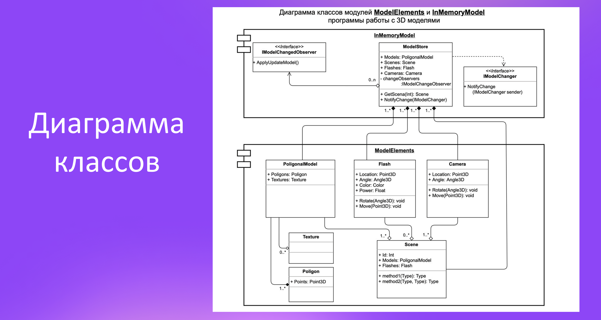

## Архитектура ПО (семинары)

---------------

### Урок 1. Введение в понятие архитектуры, проектирование ПО и жизненный цикл программного продукта. UML-диаграммы

------------

#### Задание: На основе диаграммы классов ModelElements, разработать классы: Model Store, PoligonalModel (Texture, Poligon), Flash, Camera, Scene

-----

